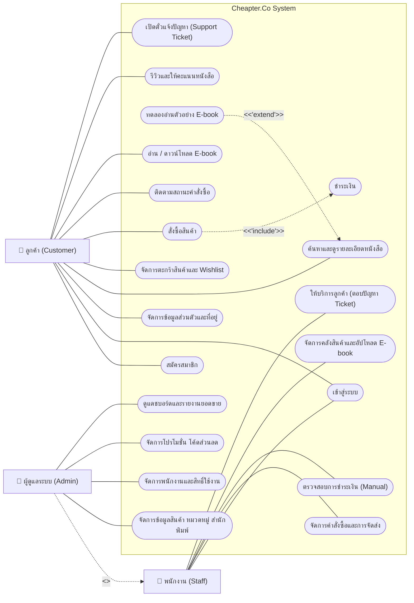
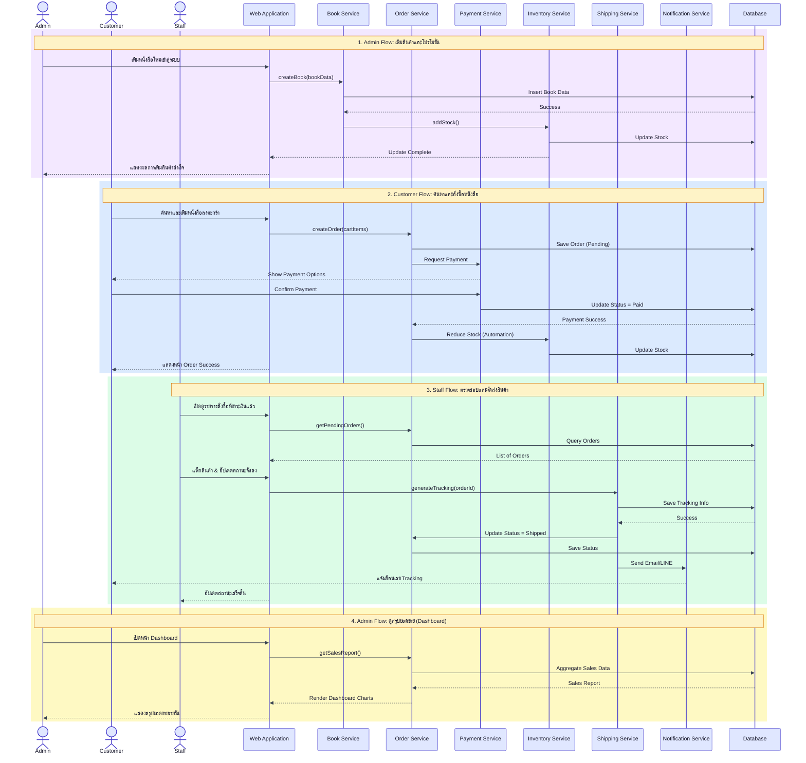
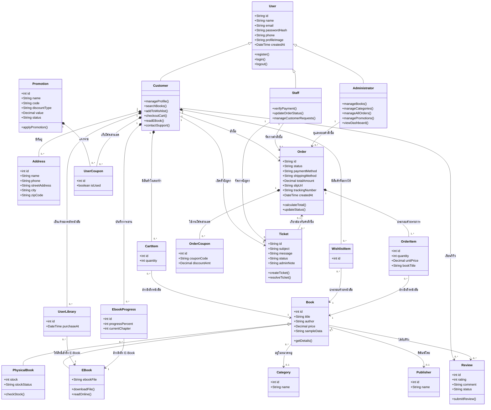
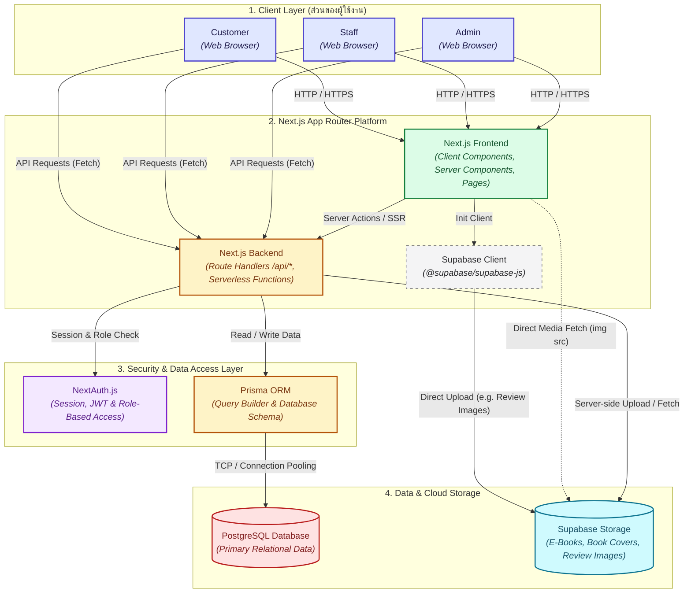

# 📚 Chapter.Co - ร้านจำหน่ายหนังสือออนไลน์ (Online Bookstore Platform)


แพลตฟอร์มร้านหนังสือออนไลน์ยุคใหม่ที่รวบรวมทั้ง **หนังสือรูปเล่ม (Physical Book)** และ **อีบุ๊ก (E-book)** เข้าไว้ด้วยกัน มุ่งเน้นการยกระดับประสบการณ์ผู้ใช้งานด้วยการออกแบบที่เรียบง่าย สบายตา และฟีเจอร์ทดลองอ่านที่ตอบโจทย์

---
# รายชื่อสมาชิก

| ลำดับ | ชื่อ-นามสกุล | รหัสนักศึกษา |
|:---:|---|---|
| 1 | นายศุภณัฐ ชวนิช  | 67155077 |
| 2 | นายอภิรักษ์ ภูมิเพ็ง  | 67164038 |
| 3 | นายณัฐพล โพธิรัตน์  | 67158185 |
| 4 | นายธีรเดช เเน่นอุดร  | 67171993   |
| 5 | นายนิรวิทธิ์ ตะกระจ่าง  | 67165280  |

---
## 📑 สารบัญ (Table of Contents)

1. [หลักการและเหตุผล](#-หลักการและเหตุผล-rationale)
2. [วัตถุประสงค์ของโครงงาน](#-วัตถุประสงค์ของโครงงาน-objectives)
3. [เครื่องมือและเทคโนโลยีที่ใช้](#️-เครื่องมือและเทคโนโลยีที่ใช้-tools--technologies)
4. [ขอบเขตของระบบ](#-ขอบเขตของระบบ-system-scope)
5. [ผู้ใช้งานและความสามารถของระบบ](#ผู้ใช้งานและความสามารถของระบบ-actors--main-functions)
6. [User Personas](#-user-personas)
7. [แผนการดำเนินงาน (Work Plan)](#-แผนการดำเนินงาน-work-plan)
8. [แนวทางการพัฒนาระบบตาม SDLC](#แนวทางการพัฒนาระบบตาม-sdlc-system-development-life-cycle)
9. [ผลลัพธ์ที่คาดว่าจะได้รับ](#-ผลลัพธ์ที่คาดว่าจะได้รับ-expected-outcomes)

---

## 📝 หลักการและเหตุผล (Rationale)

ในปัจจุบัน ร้านหนังสือแบบดั้งเดิมได้รับความนิยมน้อยลงและเข้าถึงได้ยากขึ้น ในขณะที่แพลตฟอร์มออนไลน์เติบโตอย่างรวดเร็วและเข้าถึงผู้คนได้ง่ายกว่า อย่างไรก็ตาม แพลตฟอร์มออนไลน์หลายแห่งในปัจจุบันยังประสบปัญหาที่ทำให้ผู้ใช้งานไม่ได้รับประสบการณ์ที่ดี เช่น:

* ระบบค้นหาหนังสือที่ซับซ้อนและไม่ตรงความต้องการ
* หน้าจอผู้ใช้งาน (UX/UI) ที่ใช้งานยาก ไม่สบายตา
* **ข้อจำกัดสำคัญคือ ไม่มีระบบให้ทดลองอ่านตัวอย่าง (Reading Sample)** ก่อนตัดสินใจซื้อ

คณะผู้จัดทำจึงได้พัฒนา **Chapter.Co** ขึ้นเพื่อแก้ปัญหาดังกล่าว โดยมุ่งเน้นการออกแบบ UX/UI สไตล์ **Minimalist** ที่สะอาดตา มีระบบค้นหาอัจฉริยะ และฟีเจอร์อ่านตัวอย่าง E-book ก่อนซื้อ เพื่อเพิ่มความมั่นใจและสร้างประสบการณ์ที่ดีที่สุดในการเลือกซื้อหนังสือ

---

## 🎯 วัตถุประสงค์ของโครงงาน (Objectives)

1. เพื่อพัฒนาระบบร้านหนังสือออนไลน์ที่รองรับการขายทั้งหนังสือแบบจัดส่ง (Physical Book) และหนังสืออิเล็กทรอนิกส์ (E-book)
2. เพื่อออกแบบและพัฒนาส่วนติดต่อผู้ใช้งาน (UX/UI) ให้มีความทันสมัย ใช้งานง่าย ค้นหาหนังสือได้สะดวกรวดเร็ว และสบายตา
3. เพื่อสร้างฟีเจอร์ **"ทดลองอ่านตัวอย่าง" (Preview/Sample)** ช่วยประกอบการตัดสินใจซื้อของผู้ใช้งาน
4. เพื่อขยายโอกาสให้ผู้ใช้งานสามารถเข้าถึงหนังสือที่ต้องการได้มากขึ้นและสะดวกยิ่งขึ้น

---

## 🛠️ เครื่องมือและเทคโนโลยีที่ใช้ (Tools & Technologies)

* **Frontend:** `Next.js` (React Framework สำหรับการพัฒนาเว็บแอปพลิเคชันที่รวดเร็วและรองรับ SEO)
* **Backend:** `Node.js` (สภาพแวดล้อมสำหรับจัดการระบบหลังบ้านและการประมวลผลข้อมูล)
* **Database:** `postgreSQL (supabase)` (ใช้สำหรับจำลองและจัดเก็บข้อมูล)
* **ORM:** `Prisma` (ใช้สำหรับจำลองและจัดเก็บข้อมูล)
* **cloud storage:** `Supabse` (ใช้สำหรับจำลองและจัดเก็บข้อมูล)
* **Design Tool:** `Figma` (ใช้สำหรับออกแบบ Wireframe และ High-Fidelity UX/UI Mockup)
* **Version Control:** `Git` & `GitHub` (ระบบควบคุมเวอร์ชันและจัดเก็บซอร์สโค้ด)
* **Deployment:** `Vercel` (ระบบควบคุมเวอร์ชันและจัดเก็บซอร์สโค้ด)


---

## 📐 ขอบเขตของระบบ (System Scope)

ระบบจะประกอบด้วยฟังก์ชันหลัก ดังนี้

1. ระบบจัดการสมาชิก (Register / Login)
2. ระบบจัดการข้อมูลหนังสือและหมวดหมู่
3. ระบบค้นหาและแสดงรายละเอียดหนังสือ
4. ระบบตะกร้าสินค้า (Shopping Cart)
5. ระบบสั่งซื้อสินค้า (Order Management)
6. ระบบชำระเงิน (Mockup Payment)
7. ระบบจัดส่งและติดตามสถานะคำสั่งซื้อ
8. ระบบ E-book และคลังหนังสือส่วนตัว
9. ระบบรีวิวและให้คะแนนหนังสือ
10. ระบบบริการลูกค้าและการแจ้งปัญหา
11. ระบบจัดการสินค้าและคลังสินค้า
12. ระบบโปรโมชั่นและคูปองส่วนลด
13. Dashboard และรายงานสรุป

---

## ผู้ใช้งานและความสามารถของระบบ (Actors & Main Functions)

### 1. Customer (ลูกค้า)

- สมัครสมาชิก / เข้าสู่ระบบ / ออกจากระบบ
- จัดการข้อมูลส่วนตัวและที่อยู่จัดส่ง
- ค้นหาและดูรายละเอียดหนังสือ
- ทดลองอ่านตัวอย่างหนังสือ
- เพิ่ม แก้ไข และลบสินค้าในตะกร้า
- เพิ่มหนังสือลง Wishlist
- สั่งซื้อสินค้า
- ชำระเงิน
- ติดตามสถานะและประวัติคำสั่งซื้อ
- อ่านและดาวน์โหลด E-book
- รีวิวและให้คะแนนหนังสือ
- แจ้งปัญหาและติดต่อฝ่ายบริการลูกค้า

### 2. Staff (พนักงาน)

- เข้าสู่ระบบ / ออกจากระบบ
- ตรวจสอบรายการคำสั่งซื้อ
- ตรวจสอบและยืนยันการชำระเงิน (กรณีระบบไม่สามารถยืนยันอัตโนมัติได้)
- อัปเดตสถานะคำสั่งซื้อ
- เพิ่มเลข Tracking และพิมพ์ใบจัดส่ง
- ตรวจสอบข้อมูลสินค้าและจำนวนคงเหลือในคลัง
- อัปโหลด E-book
- ตอบแชทและจัดการคำร้องของลูกค้า

### 3. Administrator (ผู้ดูแลระบบ)

- เข้าสู่ระบบ / ออกจากระบบ
- จัดการข้อมูลสินค้าและหมวดหมู่
- จัดการคำสั่งซื้อทั้งหมด
- จัดการบัญชี Staff และกำหนดสิทธิ์
- จัดการโปรโมชั่น คูปอง และแบนเนอร์
- ดู Dashboard และรายงานสรุป
- เเละส่วนของการทำงานที่เหมือน Staff ทั้งหมด

---

## 👤 User Personas

เพื่อให้การออกแบบระบบตอบโจทย์ผู้ใช้งานแต่ละกลุ่มอย่างแท้จริง คณะผู้จัดทำได้กำหนด Persona ตัวแทนของผู้ใช้งานแต่ละบทบาท (Actor) บทบาทละ 1 คน ดังนี้

### 🧑‍💻 Persona 1: Customer (ลูกค้า)

**Profile**
| หัวข้อ | รายละเอียด |
|---|---|
| ชื่อ | ปาณิสรา ใจดี (แนน) |
| อายุ | 26 ปี |
| อาชีพ | พนักงานบริษัทเอกชน (ฝ่ายการตลาด) |
| อุปกรณ์ที่ใช้ | สมาร์ตโฟน และโน้ตบุ๊กส่วนตัว |

**Bio**
แนนเป็นคนที่ชอบอ่านหนังสือเป็นชีวิตจิตใจ โดยเฉพาะนิยายและหนังสือพัฒนาตนเอง เธอมักซื้อหนังสือช่วงเวลาว่างระหว่างเดินทางไปทำงานด้วยรถไฟฟ้า และชอบลองอ่านตัวอย่างก่อนตัดสินใจซื้อเสมอ เพราะเคยผิดหวังกับหนังสือที่ซื้อโดยไม่ได้อ่านตัวอย่างมาก่อน

**Goals**
- ค้นหาหนังสือที่ตรงกับความสนใจได้อย่างรวดเร็ว
- ทดลองอ่านตัวอย่างก่อนตัดสินใจซื้อ เพื่อลดความเสี่ยงในการซื้อหนังสือที่ไม่ถูกใจ
- สั่งซื้อและชำระเงินได้สะดวกทั้งบนมือถือและคอมพิวเตอร์
- ติดตามสถานะการจัดส่งได้แบบเรียลไทม์

**Pain Points**
- แพลตฟอร์มร้านหนังสือออนไลน์หลายแห่งไม่มีระบบทดลองอ่านตัวอย่าง
- ระบบค้นหาหนังสือของหลายเว็บไซต์ไม่แม่นยำ ต้องเสียเวลาค้นหานาน
- หน้าจอใช้งานซับซ้อน ไม่เป็นมิตรกับผู้ใช้งานมือใหม่

**Scenario**
วันหนึ่งระหว่างเดินทางกลับบ้าน แนนเปิดแอป Chapter.Co เพื่อค้นหานิยายเล่มใหม่ที่เพื่อนแนะนำ เธอพิมพ์ชื่อเรื่องในช่องค้นหาและพบหนังสือทันที จากนั้นกดปุ่ม "ทดลองอ่าน" เพื่ออ่านตัวอย่างบทแรกก่อนตัดสินใจ เมื่อถูกใจ เธอจึงเลือกซื้อในรูปแบบ E-book เพื่อให้สามารถอ่านต่อได้ทันทีโดยไม่ต้องรอการจัดส่ง

---

### 📦 Persona 2: Staff (พนักงาน)

**Profile**
| หัวข้อ | รายละเอียด |
|---|---|
| ชื่อ | กันตพงศ์ รุ่งเรือง (บอส) |
| อายุ | 24 ปี |
| อาชีพ | พนักงานฝ่ายคลังสินค้าและจัดส่ง |
| อุปกรณ์ที่ใช้ | คอมพิวเตอร์ตั้งโต๊ะที่หน้างานคลังสินค้า |

**Bio**
บอสทำงานในฝ่ายคลังสินค้ามานานกว่า 2 ปี รับผิดชอบตั้งแต่การตรวจสอบรายการคำสั่งซื้อ การแพ็กสินค้า ไปจนถึงการบันทึกสถานะการจัดส่งลงระบบ ด้วยปริมาณคำสั่งซื้อที่มีจำนวนมากในแต่ละวัน เขาจึงต้องการระบบหลังบ้านที่ใช้งานง่าย ไม่ซับซ้อน แสดงข้อมูลชัดเจน และช่วยให้การบันทึกข้อมูลทำงานได้อย่างถูกต้องแม่นยำ

**Goals**
- ตรวจสอบและอัปเดตสถานะคำสั่งซื้อได้อย่างรวดเร็วและถูกต้อง
- เช็กสต็อกสินค้าได้อย่างแม่นยำเพื่อป้องกันสินค้าขาดหรือเกิน
- พิมพ์ใบจัดส่งและเพิ่มเลข Tracking ได้ในขั้นตอนเดียว

**Pain Points**
- ระบบเดิมมีขั้นตอนการกรอกข้อมูลซ้ำซ้อน ทำให้ใช้เวลาจัดการต่อออเดอร์นานและเสี่ยงต่อการคีย์ข้อมูลผิด
- ข้อมูลสต็อกสินค้าในคลังไม่ตรงกับข้อมูลในระบบ ทำให้เกิดปัญหาแพ็กสินค้าผิดหรือไม่มีสินค้าจัดส่ง
- ค้นหารายการคำสั่งซื้อที่ค้างส่งได้ยาก ทำให้เสี่ยงต่อการส่งสินค้าล่าช้าหรือตกหล่น

**Scenario**
ทุกเช้าบอสจะเข้าสู่ระบบหลังบ้านของ Chapter.Co เพื่อเช็กรายการคำสั่งซื้อใหม่ที่เข้ามา เมื่อตรวจสอบรายการสินค้าและจัดแพ็กเรียบร้อยแล้ว บอสจะทำการพิมพ์ใบจัดส่ง กรอกเลข Tracking บันทึกลงในระบบ และกดเปลี่ยนสถานะคำสั่งซื้อเป็น "จัดส่งแล้ว" เพื่อให้กระบวนการทำงานในแต่ละวันเสร็จสิ้นอย่างเรียบร้อย

---

### 🛠️ Persona 3: Administrator (ผู้ดูแลระบบ)

**Profile**
| หัวข้อ | รายละเอียด |
|---|---|
| ชื่อ | ชลธิชา ศรีสุข (มิ้นต์) |
| อายุ | 32 ปี |
| อาชีพ | ผู้จัดการร้านและผู้ดูแลระบบ Chapter.Co |
| อุปกรณ์ที่ใช้ | คอมพิวเตอร์ตั้งโต๊ะและโน้ตบุ๊ก |

**Bio**
มิ้นต์รับผิดชอบการบริหารจัดการภาพรวมของร้านค้าออนไลน์ ทั้งด้านสินค้า โปรโมชั่น บัญชีพนักงาน และการวิเคราะห์ยอดขาย เธอต้องการเครื่องมือที่ช่วยให้มองเห็นภาพรวมธุรกิจได้ง่าย เพื่อใช้ประกอบการตัดสินใจเชิงกลยุทธ์ได้อย่างรวดเร็ว

**Goals**
- ดูภาพรวมยอดขายและผลประกอบการผ่าน Dashboard ได้แบบเรียลไทม์
- จัดการข้อมูลสินค้า หมวดหมู่ และโปรโมชั่นได้อย่างมีประสิทธิภาพ
- กำหนดสิทธิ์การใช้งานของพนักงานแต่ละคนได้อย่างเหมาะสม

**Pain Points**
- ระบบเดิมไม่มี Dashboard สำหรับวิเคราะห์ยอดขาย ต้องรวบรวมข้อมูลด้วยมือ
- การจัดการโปรโมชั่นและคูปองในระบบเดิมทำได้ยากและใช้เวลานาน
- ไม่สามารถตรวจสอบสิทธิ์การเข้าถึงของพนักงานแต่ละคนได้อย่างละเอียด

**Scenario**
ทุกสิ้นสัปดาห์ มิ้นต์เข้าสู่ระบบ Admin Panel ของ Chapter.Co เพื่อดู Dashboard สรุปยอดขาย จำนวนคำสั่งซื้อ และหนังสือขายดีประจำสัปดาห์ เธอพบว่าสต็อกหนังสือบางเล่มใกล้หมด จึงเข้าไปอัปเดตข้อมูลสินค้าและเปิดโปรโมชั่นส่วนลดพิเศษเพื่อกระตุ้นยอดขายเล่มอื่น พร้อมทั้งตรวจสอบรายงานผลการทำงานของระบบ เพื่อยืนยันว่าการยืนยันการชำระเงินและการแจ้งเตือนลูกค้าทำงานได้ปกติตลอดสัปดาห์ที่ผ่านมา

---

## 🗓️ แผนการดำเนินงาน (Work Plan)

แผนการดำเนินงานของโครงการ Chapter.Co จัดทำขึ้นตามหลักการ **SDLC (System Development Life Cycle)** โดยแบ่งการดำเนินงานออกเป็น 4 ระยะหลัก ดังนี้

| ระยะ (Phase) | กิจกรรมหลัก | ระยะเวลา (โดยประมาณ) | ผลลัพธ์ที่ได้ (Deliverables) |
|---|---|---|---|
| **1. Planning & Analysis**<br>(การวางแผนและวิเคราะห์) | ศึกษาปัญหา, วิเคราะห์คู่แข่ง, เก็บข้อมูลผู้ใช้งาน, กำหนดขอบเขตโครงการ, วิเคราะห์ Functional/Non-functional Requirements, จัดทำแบบจำลองระบบ | สัปดาห์ที่ 1 | เอกสาร Project Scope, System Requirement Specification (SRS), Use Case/Activity/ER Diagram |
| **2. System Design**<br>(การออกแบบระบบ) | ออกแบบสถาปัตยกรรมระบบ, ออกแบบฐานข้อมูล, ออกแบบ UX/UI ด้วย Figma, จัดทำ Prototype | สัปดาห์ที่ 2 - 3 | Wireframe, High-Fidelity Mockup, Database Schema, Interactive Prototype |
| **3. Development**<br>(การพัฒนาระบบ) | พัฒนา Frontend, Backend, Database, และ API ตามที่ออกแบบไว้ พร้อมบริหารจัดการเวอร์ชันด้วย Git/GitHub | สัปดาห์ที่ 4 - 6 | ระบบเวอร์ชันพัฒนา (Development Build) ที่พร้อมทดสอบ |
| **4. Testing & Deployment**<br>(การทดสอบและติดตั้งระบบ) | ทดสอบระบบด้วย User Acceptance Testing (UAT) แบบ Manual Testing, แก้ไขข้อผิดพลาด, ติดตั้งระบบบนสภาพแวดล้อมจำลอง, ทดสอบหลังติดตั้ง | สัปดาห์ที่ 7 | ระบบที่ผ่านการทดสอบ UAT และพร้อมใช้งานจริง |

> **หมายเหตุ:** ระยะเวลาข้างต้นเป็นการประมาณการเบื้องต้น อาจมีการปรับเปลี่ยนตามความเหมาะสมของทรัพยากรและความซับซ้อนของงานจริง

---

# แนวทางการพัฒนาระบบตาม SDLC (System Development Life Cycle)

การพัฒนาเว็บไซต์ร้านหนังสือออนไลน์ที่รองรับทั้งหนังสือแบบจัดส่งและ E-Book พร้อมระบบที่ช่วยแก้ไขปัญหาของร้านหนังสือทั้ง Online และ On-site ดำเนินการตามกระบวนการ **System Development Life Cycle (SDLC)** ซึ่งเป็นแนวทางมาตรฐานในการพัฒนาระบบสารสนเทศ เพื่อให้ระบบมีความถูกต้อง มีคุณภาพ และสามารถตอบสนองต่อความต้องการของผู้ใช้งานได้อย่างมีประสิทธิภาพ

---

## 1. Planning (การวางแผน)

### วัตถุประสงค์

ขั้นตอนการวางแผนเป็นจุดเริ่มต้นของการพัฒนาระบบ โดยมีเป้าหมายเพื่อศึกษาปัญหาของระบบเดิม วิเคราะห์ความเป็นไปได้ของโครงการ และกำหนดขอบเขตการดำเนินงานให้ชัดเจน เพื่อให้การพัฒนาเป็นไปในทิศทางเดียวกันและสามารถบริหารทรัพยากรได้อย่างมีประสิทธิภาพ

### กิจกรรมที่ดำเนินการ

**1.1 ศึกษาปัญหา (Problem Identification)**

ศึกษาปัญหาที่เกิดขึ้นกับเว็บไซต์ร้านหนังสือออนไลน์ในปัจจุบัน ทั้งในประเทศไทยและต่างประเทศ เช่น

- ระบบค้นหาหนังสือทำงานได้ไม่แม่นยำ
- เว็บไซต์ใช้งานยาก มีขั้นตอนการสั่งซื้อซับซ้อน
- ไม่มีระบบทดลองอ่านหนังสือ
- การจัดการสต็อกระหว่างหน้าร้านและออนไลน์ไม่เชื่อมต่อกัน
- ระบบแนะนำหนังสือยังไม่ตอบโจทย์ผู้ใช้งาน
- ไม่มี Dashboard สำหรับวิเคราะห์ยอดขาย

**1.2 ศึกษาข้อมูลที่เกี่ยวข้อง**

ศึกษาข้อมูลจาก
- ระบบ E-Commerce ที่ประสบความสำเร็จ (Shoppee)

เพื่อใช้เป็นแนวทางในการออกแบบระบบ

**1.3 วิเคราะห์คู่แข่ง (Competitor Analysis)**

ศึกษาฟังก์ชันของเว็บไซต์ร้านหนังสือต่าง ๆ เช่น

- ระบบค้นหา
- ระบบสมาชิก
- ระบบรีวิว
- ระบบโปรโมชั่น
- ระบบแนะนำสินค้า

เพื่อหาจุดเด่นและข้อจำกัดของแต่ละระบบ

**1.4 เก็บรวบรวมข้อมูลจากผู้ใช้งาน**

ดำเนินการเก็บข้อมูลจากกลุ่มเป้าหมายผ่าน

- แบบสอบถามออนไลน์ (Questionnaire)
- การสัมภาษณ์ (Interview)
- การสังเกตการใช้งาน (Observation)

โดยข้อมูลที่รวบรวม เช่น

- ปัญหาที่พบระหว่างใช้งาน
- ความต้องการของผู้ใช้
- ฟีเจอร์ที่ต้องการเพิ่มเติม
- ความพึงพอใจต่อระบบเดิม

**1.5 กำหนดขอบเขตโครงการ (Project Scope)**

กำหนดขอบเขตของระบบ เช่น

- ระบบซื้อหนังสือแบบจัดส่ง
- ระบบซื้อ E-Book
- ระบบทดลองอ่าน
- ระบบสมาชิก
- ระบบชำระเงิน
- ระบบจัดการคลังสินค้า
- ระบบบริหารร้านค้า
- Dashboard รายงานยอดขาย

**1.6 วางแผนโครงการ**

กำหนด

- ระยะเวลาการดำเนินงาน
- บุคลากร
- เครื่องมือที่ใช้
- งบประมาณ
- ความเสี่ยงของโครงการ

---

## 2. Analysis (การวิเคราะห์)

### วัตถุประสงค์

นำข้อมูลทั้งหมดที่รวบรวมได้มาวิเคราะห์ เพื่อกำหนดความต้องการของระบบ (System Requirements) และหาแนวทางแก้ไขปัญหาที่เหมาะสม

### วิเคราะห์ปัญหาระบบเดิม

วิเคราะห์ข้อจำกัดของระบบ เช่น

- UX/UI ไม่เป็นมิตรกับผู้ใช้
- ระบบค้นหาช้า
- ไม่มีระบบทดลองอ่าน
- ระบบจัดการสต็อกไม่มีประสิทธิภาพ
- ไม่มีระบบสะสมแต้ม
- ไม่มีระบบแจ้งเตือน
- ไม่มีระบบวิเคราะห์ยอดขาย

### วิเคราะห์ความต้องการของผู้ใช้งาน

**Functional Requirements**

- สมัครสมาชิก
- เข้าสู่ระบบ
- ค้นหาหนังสือ
- ซื้อหนังสือ
- ดาวน์โหลด E-Book
- ทดลองอ่าน
- รีวิวหนังสือ
- ระบบโปรโมชั่น
- ระบบแจ้งเตือน
- ระบบจัดการคำสั่งซื้อ
- ระบบจัดการสต็อก
- Dashboard

**Non-functional Requirements**

- รองรับผู้ใช้งานจำนวนมาก
- โหลดหน้าเว็บรวดเร็ว
- รองรับมือถือ
- มีความปลอดภัย
- รองรับ SEO
- สำรองข้อมูล
- มีความพร้อมใช้งานสูง

### จัดทำแบบจำลองระบบ

สร้างเอกสารประกอบการวิเคราะห์ เช่น

- Persona Design
- Use Case Diagram
- Sequence Diagram
- Class Diagram
- Wireframe / Prototype
- Data Schema
- System Architecture

---

## 3. Design (การออกแบบ)

### วัตถุประสงค์

ออกแบบระบบให้ตรงกับความต้องการที่ได้จากการวิเคราะห์ ทั้งด้านโครงสร้างระบบ ฐานข้อมูล และส่วนติดต่อผู้ใช้งาน

### ออกแบบสถาปัตยกรรมระบบ

แบ่งระบบออกเป็น

- Frontend
- Backend
- Database
- API Layer

เพื่อให้แต่ละส่วนสามารถทำงานร่วมกันได้

### ออกแบบฐานข้อมูล

ออกแบบฐานข้อมูลด้วยหลัก Database Normalization

ตัวอย่างตาราง

- Users
- Books
- Categories
- Orders
- Order Details
- Payments
- Reviews
- Inventory
- Promotions
- Coupons
- EBooks

กำหนด

- Primary Key
- Foreign Key
- Relationship

### ออกแบบ User Interface (UI)

ใช้ **Figma** ในการออกแบบหน้าจอ เช่น

- Home
- Search
- Book Detail
- Cart
- Checkout
- Profile
- Dashboard
- Admin Panel

โดยเน้น

- Modern Design
- Minimal Design
- Responsive Design
- User Friendly

### ออกแบบ User Experience (UX)

ออกแบบขั้นตอนการใช้งานให้สะดวกที่สุด เช่น

- ค้นหาหนังสือ
- ทดลองอ่าน
- เพิ่มลงตะกร้า
- ชำระเงิน
- ดาวน์โหลด E-Book

### สร้าง Prototype

สร้าง Interactive Prototype เพื่อให้ผู้ใช้งานทดลองก่อนเริ่มพัฒนาจริง

---

## 4. Development (การพัฒนา)

### วัตถุประสงค์

พัฒนาระบบจริงตามแบบที่ออกแบบไว้

### Frontend Development

พัฒนา

- หน้าเว็บไซต์
- ระบบ Responsive
- ระบบค้นหา
- ระบบตะกร้าสินค้า
- ระบบทดลองอ่าน
- Dashboard

### Backend Development

พัฒนา

- ระบบ Login
- Authentication
- Authorization
- CRUD
- ระบบคำสั่งซื้อ
- ระบบชำระเงิน
- ระบบสต็อก
- ระบบรายงาน

### Database Development

ดำเนินการ

- สร้างฐานข้อมูล
- สร้าง Table
- Constraint
- Trigger
- Stored Procedure (ถ้ามี)

### API Development

สร้าง REST API สำหรับเชื่อมต่อ

- Frontend
- Mobile Application (ในอนาคต)
- Payment Gateway
- Email Service
- Notification

### Version Control

ใช้ Git และ GitHub

- Branch
- Merge
- Pull Request
- Version Management

---

## 5. Testing (การทดสอบ)

### วัตถุประสงค์

ตรวจสอบว่าระบบสามารถทำงานได้ถูกต้องและตรงตามความต้องการของผู้ใช้งานจริง โดยโครงการนี้เลือกใช้แนวทางการทดสอบเพียงรูปแบบเดียว คือ **User Acceptance Testing (UAT)** ในลักษณะ **Manual Testing** เพื่อให้มั่นใจว่าระบบตอบโจทย์การใช้งานจริงของผู้ใช้แต่ละกลุ่ม (Customer, Staff, Administrator)

### แนวทางการทดสอบ (Testing Approach)

- **ประเภทการทดสอบ:** User Acceptance Testing (UAT) เพียงอย่างเดียว
- **รูปแบบการทดสอบ:** Manual Testing โดยผู้ทดสอบดำเนินการทดสอบด้วยตนเองตาม Test Case ที่กำหนดไว้ล่วงหน้า ไม่ใช้เครื่องมือทดสอบอัตโนมัติ (Automated Testing Tools)

### ขั้นตอนการทดสอบ (UAT Process)

1. จัดทำ Test Case / Test Scenario ตามฟังก์ชันหลักของระบบ
2. ให้ผู้ใช้งานจริงทดลองใช้งานระบบตาม Scenario ที่กำหนด
3. เก็บรวบรวม Feedback และปัญหาที่พบระหว่างการทดสอบ
4. วิเคราะห์และจัดลำดับความสำคัญของปัญหาที่พบ (Bug/Issue Priority)
5. แก้ไขข้อผิดพลาดและปรับปรุงระบบ
6. ทดสอบซ้ำ (Retest) จนกว่าระบบจะผ่านเกณฑ์ที่กำหนด

### ขอบเขตการทดสอบ (Scope of Testing)

- ระบบสมัครสมาชิก / เข้าสู่ระบบ
- ระบบค้นหาและแสดงรายละเอียดหนังสือ
- ระบบตะกร้าสินค้าและการสั่งซื้อ
- ระบบชำระเงิน (Mockup Payment)
- ระบบทดลองอ่านตัวอย่าง E-book
- ระบบจัดการคำสั่งซื้อ (ฝั่ง Staff/Administrator)
- ระบบ Dashboard และรายงานสรุป

---

## 6. Deployment (การติดตั้งและเปิดใช้งานระบบ)

### วัตถุประสงค์

นำระบบที่ผ่านการทดสอบ UAT และได้รับการอนุมัติแล้ว ขึ้นติดตั้งและเปิดใช้งานบนสภาพแวดล้อมจริง (Production Environment) เพื่อให้ผู้ใช้งานสามารถเข้าถึงและเริ่มใช้งานระบบอย่างเป็นทางการ

### การตรวจสอบหลังเปิดใช้งานจริง (Post-Deployment Verification)
ดำเนินการตรวจสอบความถูกต้องของระบบบนสภาพแวดล้อมจริง (Smoke Testing) ก่อนเปิดให้บริการเต็มรูปแบบ ได้แก่:

- ระบบลงชื่อเข้าใช้งาน: ตรวจสอบการเข้าสู่ระบบของทุกกลุ่มผู้ใช้งาน (Customer, Staff, Administrator)

- ระบบชำระเงิน: ตรวจสอบการเชื่อมต่อและทำรายการผ่าน Payment Gateway

- ระบบ E-Book: ตรวจสอบความถูกต้องของการสั่งซื้อ ดาวน์โหลด และเปิดอ่านไฟล์ E-Book

- การแสดงผลระบบ: ตรวจสอบการแสดงผลทุกหน้าจอและ Responsive Design บนอุปกรณ์ต่างๆ

---

## 7. Maintenance (การบำรุงรักษา)

### วัตถุประสงค์

ดูแลและปรับปรุงระบบอย่างต่อเนื่องหลังจากนำระบบไปใช้งาน

### Corrective Maintenance

- แก้ไข Bug
- แก้ไขข้อผิดพลาด
- แก้ไขปัญหาที่ผู้ใช้งานแจ้ง

### Adaptive Maintenance

- รองรับ Browser ใหม่
- รองรับอุปกรณ์ใหม่
- รองรับเทคโนโลยีใหม่

### Perfective Maintenance

ปรับปรุง

- UX/UI
- ระบบค้นหา
- Dashboard
- ระบบแนะนำหนังสือ
- ฟีเจอร์ใหม่

### Preventive Maintenance

ดำเนินการ

- Backup ข้อมูล
- ตรวจสอบ Server
- อัปเดตระบบ
- ตรวจสอบความปลอดภัย
- ป้องกันปัญหาที่อาจเกิดขึ้นในอนาคต

### การรับข้อเสนอแนะ

หลังการนำเสนอและทดลองใช้งาน จะรวบรวมความคิดเห็นจากผู้ใช้งาน เพื่อนำมาปรับปรุงและพัฒนาระบบในเวอร์ชันถัดไป เพื่อเพิ่มประสิทธิภาพ รองรับจำนวนผู้ใช้งานที่เพิ่มขึ้น และตอบสนองต่อความต้องการของธุรกิจร้านหนังสือในอนาคต

---

## 🚀 ผลลัพธ์ที่คาดว่าจะได้รับ (Expected Outcomes)

1. ได้แพลตฟอร์มร้านหนังสือออนไลน์ **Chapter.Co** ที่สามารถจัดจำหน่ายได้ทั้งหนังสือเล่มและ E-book ซึ่งสามารถใช้งานได้จริง
2. ผู้ใช้งานได้รับประสบการณ์การใช้งาน (User Experience) ที่ดียิ่งขึ้น ผ่านหน้าจอที่ออกแบบมาให้ค้นหาง่ายและสบายตา
3. ฟีเจอร์ทดลองอ่านช่วยสร้างความมั่นใจให้ผู้ซื้อก่อนการตัดสินใจ ซึ่งช่วยเพิ่มโอกาสและยอดขายให้กับแพลตฟอร์ม
4. มีระบบบริหารจัดการข้อมูลสินค้าและสต็อกหลังบ้านที่มีประสิทธิภาพสำหรับผู้ดูแลระบบ


# Diagram

## Use Case Diagram



## Sequence Diagram



## Class Diagram


## System Architecture



## JSON Schema

```json
{
  "$schema": "[http://json-schema.org/draft-07/schema#](http://json-schema.org/draft-07/schema#)",
  "title": "BookstoreDatabaseSchema",
  "description": "JSON Schema derived from Prisma Schema for Bookstore System",
  "type": "object",
  "definitions": {
    "UserRole": {
      "type": "string",
      "enum": ["CUSTOMER", "STAFF", "ADMIN"]
    },
    "UserStatus": {
      "type": "string",
      "enum": ["Active", "Banned"]
    },
    "BookType": {
      "type": "string",
      "enum": ["Hardcover", "EBook", "Manga", "Pack"]
    },
    "StockStatus": {
      "type": "string",
      "enum": ["InStock", "LowStock", "OutOfStock"]
    },
    "DiscountType": {
      "type": "string",
      "enum": ["percent", "fixed", "freeship"]
    },
    "PromotionStatus": {
      "type": "string",
      "enum": ["Active", "Expired", "Disabled"]
    },
    "OrderStatus": {
      "type": "string",
      "enum": [
        "PENDING",
        "VERIFYING",
        "PREPARING",
        "SHIPPING",
        "COMPLETED",
        "CANCELLED",
        "REFUNDED"
      ]
    },
    "PaymentMethod": {
      "type": "string",
      "enum": ["promptpay", "credit_card", "bank_transfer", "cod"]
    },
    "ShippingMethod": {
      "type": "string",
      "enum": ["standard", "express", "digital"]
    },
    "TicketStatus": {
      "type": "string",
      "enum": ["OPEN", "PENDING", "CLOSED"]
    },
    "POStatus": {
      "type": "string",
      "enum": ["Pending", "Partial", "Completed", "Cancelled"]
    },
    "StockMovementType": {
      "type": "string",
      "enum": ["IN", "OUT", "DAMAGED", "ADJUST"]
    },
    "User": {
      "type": "object",
      "properties": {
        "id": { "type": "string" },
        "name": { "type": "string" },
        "email": { "type": "string", "format": "email" },
        "passwordHash": { "type": "string" },
        "role": { "$ref": "#/definitions/UserRole", "default": "CUSTOMER" },
        "status": { "$ref": "#/definitions/UserStatus", "default": "Active" },
        "phone": { "type": ["string", "null"] },
        "birthdate": { "type": ["string", "null"], "format": "date-time" },
        "profileImage": { "type": ["string", "null"] },
        "createdAt": { "type": "string", "format": "date-time" },
        "updatedAt": { "type": "string", "format": "date-time" }
      },
      "required": ["id", "name", "email", "passwordHash", "createdAt", "updatedAt"]
    },
    "Address": {
      "type": "object",
      "properties": {
        "id": { "type": "integer" },
        "label": { "type": "string" },
        "name": { "type": "string" },
        "phone": { "type": "string" },
        "streetAddress": { "type": "string" },
        "city": { "type": "string" },
        "zipCode": { "type": "string" },
        "isDefault": { "type": "boolean", "default": false },
        "userId": { "type": "string" },
        "createdAt": { "type": "string", "format": "date-time" },
        "updatedAt": { "type": "string", "format": "date-time" }
      },
      "required": [
        "id",
        "label",
        "name",
        "phone",
        "streetAddress",
        "city",
        "zipCode",
        "userId",
        "createdAt",
        "updatedAt"
      ]
    },
    "Publisher": {
      "type": "object",
      "properties": {
        "id": { "type": "integer" },
        "name": { "type": "string" },
        "createdAt": { "type": "string", "format": "date-time" },
        "updatedAt": { "type": "string", "format": "date-time" }
      },
      "required": ["id", "name", "createdAt", "updatedAt"]
    },
    "Category": {
      "type": "object",
      "properties": {
        "id": { "type": "integer" },
        "name": { "type": "string" },
        "createdAt": { "type": "string", "format": "date-time" },
        "updatedAt": { "type": "string", "format": "date-time" }
      },
      "required": ["id", "name", "createdAt", "updatedAt"]
    },
    "Book": {
      "type": "object",
      "properties": {
        "id": { "type": "integer" },
        "title": { "type": "string" },
        "author": { "type": "string" },
        "description": { "type": ["string", "null"] },
        "isbn": { "type": ["string", "null"] },
        "pages": { "type": ["integer", "null"] },
        "publishDate": { "type": ["string", "null"] },
        "bookType": { "$ref": "#/definitions/BookType", "default": "Hardcover" },
        "price": { "type": "number", "minimum": 0 },
        "stock": { "type": "integer", "default": 0 },
        "stockStatus": { "$ref": "#/definitions/StockStatus", "default": "InStock" },
        "image": { "type": ["string", "null"] },
        "rating": { "type": ["number", "null"], "minimum": 0, "maximum": 5 },
        "reviewCount": { "type": "integer", "default": 0 },
        "sampleData": { "type": ["object", "null"] },
        "ebookFile": { "type": ["string", "null"] },
        "sampleLimit": { "type": ["integer", "null"] },
        "publisherId": { "type": ["integer", "null"] },
        "categoryId": { "type": ["integer", "null"] },
        "createdAt": { "type": "string", "format": "date-time" },
        "updatedAt": { "type": "string", "format": "date-time" }
      },
      "required": [
        "id",
        "title",
        "author",
        "price",
        "createdAt",
        "updatedAt"
      ]
    },
    "Review": {
      "type": "object",
      "properties": {
        "id": { "type": "integer" },
        "rating": { "type": "integer", "minimum": 1, "maximum": 5 },
        "comment": { "type": "string" },
        "userId": { "type": ["string", "null"] },
        "bookId": { "type": "integer" },
        "createdAt": { "type": "string", "format": "date-time" },
        "updatedAt": { "type": "string", "format": "date-time" }
      },
      "required": ["id", "rating", "comment", "bookId", "createdAt", "updatedAt"]
    },
    "Promotion": {
      "type": "object",
      "properties": {
        "id": { "type": "integer" },
        "name": { "type": "string" },
        "code": { "type": "string" },
        "discountType": { "$ref": "#/definitions/DiscountType" },
        "value": { "type": "number" },
        "status": { "$ref": "#/definitions/PromotionStatus", "default": "Active" },
        "minPurchase": { "type": "number", "default": 0 },
        "usageLimit": { "type": ["integer", "null"] },
        "usedCount": { "type": "integer", "default": 0 },
        "endDate": { "type": ["string", "null"], "format": "date-time" },
        "createdAt": { "type": "string", "format": "date-time" },
        "updatedAt": { "type": "string", "format": "date-time" }
      },
      "required": [
        "id",
        "name",
        "code",
        "discountType",
        "value",
        "createdAt",
        "updatedAt"
      ]
    },
    "UserCoupon": {
      "type": "object",
      "properties": {
        "id": { "type": "integer" },
        "userId": { "type": "string" },
        "promotionId": { "type": "integer" },
        "isUsed": { "type": "boolean", "default": false },
        "collectedAt": { "type": "string", "format": "date-time" },
        "usedAt": { "type": ["string", "null"], "format": "date-time" }
      },
      "required": ["id", "userId", "promotionId", "collectedAt"]
    },
    "CartItem": {
      "type": "object",
      "properties": {
        "id": { "type": "integer" },
        "quantity": { "type": "integer", "default": 1 },
        "userId": { "type": "string" },
        "bookId": { "type": "integer" },
        "createdAt": { "type": "string", "format": "date-time" },
        "updatedAt": { "type": "string", "format": "date-time" }
      },
      "required": ["id", "quantity", "userId", "bookId", "createdAt", "updatedAt"]
    },
    "WishlistItem": {
      "type": "object",
      "properties": {
        "id": { "type": "integer" },
        "userId": { "type": "string" },
        "bookId": { "type": "integer" },
        "createdAt": { "type": "string", "format": "date-time" }
      },
      "required": ["id", "userId", "bookId", "createdAt"]
    },
    "Order": {
      "type": "object",
      "properties": {
        "id": { "type": "string" },
        "status": { "$ref": "#/definitions/OrderStatus", "default": "PENDING" },
        "shippingMethod": { "$ref": "#/definitions/ShippingMethod", "default": "standard" },
        "paymentMethod": { "$ref": "#/definitions/PaymentMethod", "default": "promptpay" },
        "recipientName": { "type": "string" },
        "recipientPhone": { "type": ["string", "null"] },
        "shippingAddress": { "type": "string" },
        "subtotal": { "type": "number" },
        "shippingFee": { "type": "number", "default": 0 },
        "discountAmount": { "type": "number", "default": 0 },
        "taxAmount": { "type": "number", "default": 0 },
        "totalAmount": { "type": "number" },
        "slipUrl": { "type": ["string", "null"] },
        "paymentTime": { "type": ["string", "null"], "format": "date-time" },
        "trackingNumber": { "type": ["string", "null"] },
        "userId": { "type": ["string", "null"] },
        "createdAt": { "type": "string", "format": "date-time" },
        "updatedAt": { "type": "string", "format": "date-time" }
      },
      "required": [
        "id",
        "recipientName",
        "shippingAddress",
        "subtotal",
        "totalAmount",
        "createdAt",
        "updatedAt"
      ]
    },
    "OrderItem": {
      "type": "object",
      "properties": {
        "id": { "type": "integer" },
        "quantity": { "type": "integer" },
        "unitPrice": { "type": "number" },
        "bookTitle": { "type": "string" },
        "bookImage": { "type": ["string", "null"] },
        "bookType": { "$ref": "#/definitions/BookType" },
        "orderId": { "type": "string" },
        "bookId": { "type": ["integer", "null"] }
      },
      "required": [
        "id",
        "quantity",
        "unitPrice",
        "bookTitle",
        "bookType",
        "orderId"
      ]
    },
    "OrderCoupon": {
      "type": "object",
      "properties": {
        "id": { "type": "integer" },
        "couponCode": { "type": "string" },
        "discountAmt": { "type": "number" },
        "orderId": { "type": "string" },
        "promotionId": { "type": ["integer", "null"] }
      },
      "required": ["id", "couponCode", "discountAmt", "orderId"]
    },
    "UserLibrary": {
      "type": "object",
      "properties": {
        "id": { "type": "integer" },
        "purchaseAt": { "type": "string", "format": "date-time" },
        "userId": { "type": "string" },
        "bookId": { "type": "integer" }
      },
      "required": ["id", "purchaseAt", "userId", "bookId"]
    },
    "EbookProgress": {
      "type": "object",
      "properties": {
        "id": { "type": "integer" },
        "progressPercent": { "type": "integer", "minimum": 0, "maximum": 100, "default": 0 },
        "currentChapter": { "type": ["integer", "null"] },
        "lastReadAt": { "type": "string", "format": "date-time" },
        "userId": { "type": "string" },
        "bookId": { "type": "integer" },
        "createdAt": { "type": "string", "format": "date-time" },
        "updatedAt": { "type": "string", "format": "date-time" }
      },
      "required": ["id", "userId", "bookId", "createdAt", "updatedAt"]
    },
    "Ticket": {
      "type": "object",
      "properties": {
        "id": { "type": "string" },
        "subject": { "type": "string" },
        "message": { "type": "string" },
        "status": { "$ref": "#/definitions/TicketStatus", "default": "OPEN" },
        "customerName": { "type": ["string", "null"] },
        "adminNote": { "type": ["string", "null"] },
        "resolvedAt": { "type": ["string", "null"], "format": "date-time" },
        "userId": { "type": ["string", "null"] },
        "orderId": { "type": ["string", "null"] },
        "createdAt": { "type": "string", "format": "date-time" },
        "updatedAt": { "type": "string", "format": "date-time" }
      },
      "required": ["id", "subject", "message", "createdAt", "updatedAt"]
    },
    "ChatSession": {
      "type": "object",
      "properties": {
        "id": { "type": "string" },
        "status": { "$ref": "#/definitions/TicketStatus", "default": "OPEN" },
        "userId": { "type": ["string", "null"] },
        "createdAt": { "type": "string", "format": "date-time" },
        "updatedAt": { "type": "string", "format": "date-time" }
      },
      "required": ["id", "createdAt", "updatedAt"]
    },
    "ChatMessage": {
      "type": "object",
      "properties": {
        "id": { "type": "integer" },
        "sessionId": { "type": "string" },
        "senderId": { "type": ["string", "null"] },
        "senderRole": { "type": "string" },
        "message": { "type": "string" },
        "isRead": { "type": "boolean", "default": false },
        "createdAt": { "type": "string", "format": "date-time" }
      },
      "required": ["id", "sessionId", "senderRole", "message", "createdAt"]
    },
    "BookPackItem": {
      "type": "object",
      "properties": {
        "id": { "type": "integer" },
        "quantity": { "type": "integer", "default": 1 },
        "packId": { "type": "integer" },
        "bookId": { "type": "integer" }
      },
      "required": ["id", "packId", "bookId"]
    },
    "PurchaseOrder": {
      "type": "object",
      "properties": {
        "id": { "type": "string" },
        "supplier": { "type": "string" },
        "status": { "$ref": "#/definitions/POStatus", "default": "Pending" },
        "expectedDate": { "type": ["string", "null"], "format": "date-time" },
        "createdBy": { "type": "string" },
        "note": { "type": ["string", "null"] },
        "createdAt": { "type": "string", "format": "date-time" },
        "updatedAt": { "type": "string", "format": "date-time" }
      },
      "required": ["id", "supplier", "createdBy", "createdAt", "updatedAt"]
    },
    "PurchaseOrderItem": {
      "type": "object",
      "properties": {
        "id": { "type": "integer" },
        "ordered": { "type": "integer" },
        "received": { "type": "integer", "default": 0 },
        "unitCost": { "type": "number" },
        "purchaseOrderId": { "type": "string" },
        "bookId": { "type": "integer" }
      },
      "required": ["id", "ordered", "unitCost", "purchaseOrderId", "bookId"]
    },
    "StockMovement": {
      "type": "object",
      "properties": {
        "id": { "type": "integer" },
        "type": { "$ref": "#/definitions/StockMovementType" },
        "quantity": { "type": "integer" },
        "reference": { "type": ["string", "null"] },
        "performedBy": { "type": "string" },
        "note": { "type": ["string", "null"] },
        "balanceAfter": { "type": "integer", "default": 0 },
        "bookId": { "type": "integer" },
        "createdAt": { "type": "string", "format": "date-time" }
      },
      "required": ["id", "type", "quantity", "performedBy", "bookId", "createdAt"]
    }
  }
}
```
